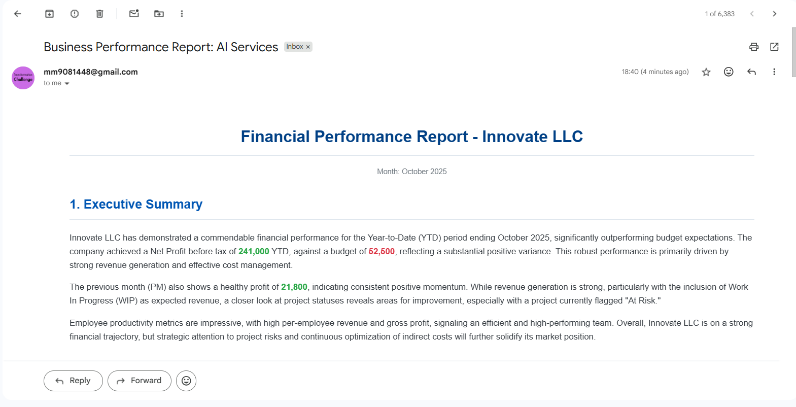
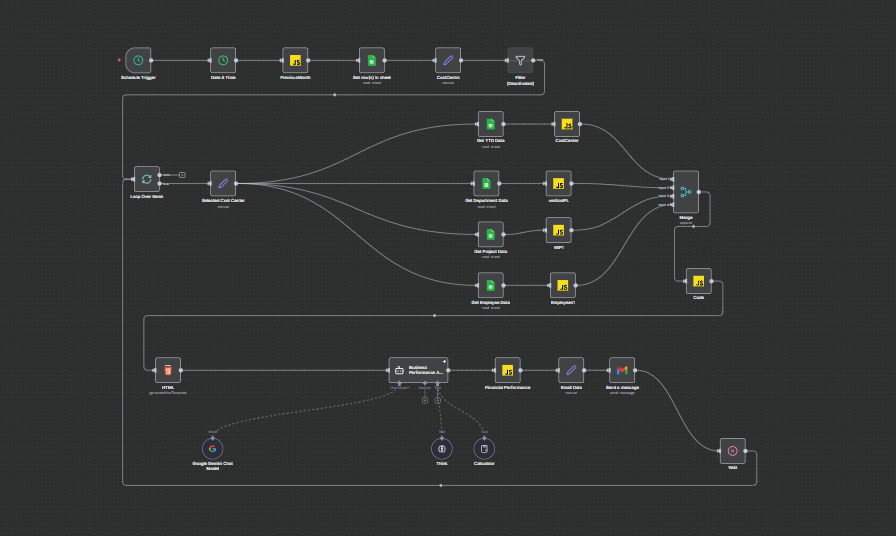

# AI-Powered Business Performance Reporting Automation

This project is an end-to-end workflow automation built in n8n that transforms raw business data into a comprehensive, AI-analyzed performance report. The system runs on a monthly schedule, saving significant manual effort and delivering actionable insights directly to stakeholders via email.

## Final Report Sample

*This is the final HTML report generated by the AI agent and sent via email.*

---

## Key Features

- **Automated Data Integration:** Extracts and transforms data from multiple sources (simulated via Google Sheets), including financials, project status (WIP), and employee metrics.
- **AI-Driven Analysis:** Integrates the Google Gemini LLM to generate a qualitative **Executive Summary**, calculate key financial metrics, and provide actionable **business recommendations**.
- **Dynamic Report Generation:** Creates beautifully formatted, responsive HTML reports from structured data, complete with color-coding for performance indicators.
- **End-to-End Automation:** The workflow is fully automated, handling everything from data fetching to final delivery via email (Gmail), requiring zero manual intervention.
- **Scalable Design:** The workflow is designed to loop through multiple business units (Cost Centers), generating a unique, tailored report for each one.

---

## Workflow Diagram

*The complete n8n workflow, from the scheduled trigger to the final email.
Sorry for blurry image.*

---

## Technologies Used

- **Workflow Automation:** n8n
- **Data Source:** Google Sheets
- **AI Model:** Google Gemini
- **Email Service:** Gmail
- **Data Handling:** JavaScript, HTML/CSS

---

## How It Works

1.  **Trigger:** A schedule trigger kicks off the workflow on a monthly basis.
2.  **Fetch Data:** The workflow reads data from five different tabs in a Google Sheet, simulating a real-world multi-source environment.
3.  **Looping:** It loops through each business unit (Cost Center) to generate a separate report for each one.
4.  **Data Transformation:** The raw data for each unit is converted into structured HTML tables.
5.  **AI Analysis:** All the HTML tables are sent to the Google Gemini agent with a detailed prompt instructing it to act as a Business Analyst. The agent calculates new metrics, writes an executive summary, and formulates recommendations.
6.  **Delivery:** The final, polished HTML output from the AI is sent as an email via Gmail.

---

## How to Use

The `My workflow.json` file in this repository can be imported into any n8n instance to replicate this project. The user will need to configure their own credentials for Google Sheets, Google Gemini, and Gmail.

---

## Acknowledgements

This project was adapted and re-engineered from an original concept and workflow demonstrated by Amjid Ali. My key contributions include migrating the data pipeline from MySQL to Google Sheets, customizing the AI prompt for a new business case, and re-configuring the final report delivery system.
